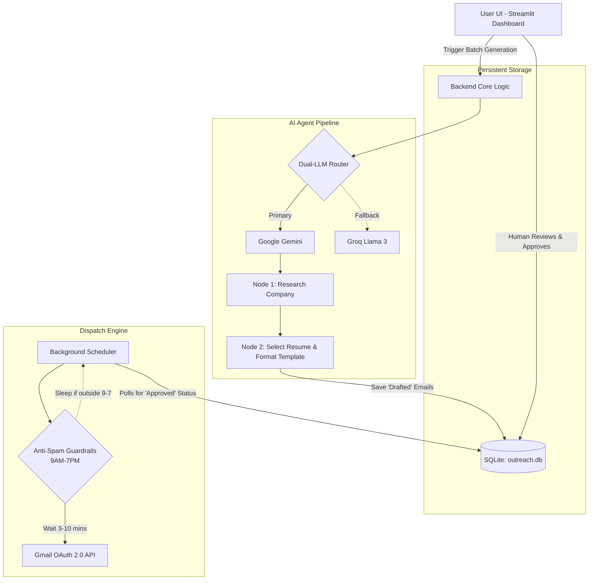

# Autonomous AI Job-Outreach Assistant 🚀

An end-to-end AI-powered autonomous web application designed to research companies, draft strictly formatted job applications, and dispatch them to HR recruiters. This assistant relies on a hybrid architecture that combines the reasoning abilities of modern LLMs (Google Gemini & Meta Llama 3) with a strictly deterministic scheduling and guardrail engine to guarantee safe, anti-spam delivery.

## 1. System Design 🏛️

The system consists of a **Streamlit** frontend dashboard operating alongside a detached **Python background scheduler**, communicating via a persistent **SQLite** database. 

**System Data Flow:**



1. **Data Ingestion**: The system reads raw HR contact lists from Excel (`.xlsx`) and securely loads them into the local SQLite database.
2. **Top Bun (Agentic Research & Drafting)**: When triggered via the UI, the LLM pipeline (`gemini-3.6-flash` with a `gpt-oss-120b` fallback) researches the target company. It dynamically selects the most appropriate PDF resume and strictly formats a personalized outreach email based on a predefined template.
3. **The Meat (Human-in-the-Loop)**: The drafted emails are staged in the UI. The user reviews the AI's logic, edits recipient emails if testing, and clicks "Approve". No email leaves the system without explicit human consent.
4. **Bottom Bun (Deterministic Dispatch Engine)**: The background scheduler (`scheduler.py`) constantly polls the database for approved emails. It runs them through a strict policy engine (guardrails) before securely transmitting them via the Gmail API as Rich HTML.

## 2. Agent Design & Logic 🧠

### 📂 Project File Structure
```text
ai-outreach-agent/
├── agents/                 # LLM logic nodes
│   ├── analysis_agent.py   # Company research & summarization
│   └── email_agent.py      # Template formatting & resume selection
├── contacts/               # Raw data ingestion
│   └── hr.xlsx             # Master HR target list
├── database/               # Persistent Storage
│   └── outreach.db         # Stateful SQLite session & queue database
├── resumes/                # Dynamic attachments
│   └── [Your PDFs].pdf     # Available resumes for the AI to select
├── services/               # Core deterministic integrations
│   ├── db_service.py       # SQLite transactions
│   ├── gmail_service.py    # Gmail OAuth 2.0 & Rich HTML payload builder
│   └── llm_service.py      # Dual-LLM routing logic
├── app.py                  # Streamlit Frontend UI
├── scheduler.py            # Deterministic Background Dispatch Engine
├── config.py               # Global thresholds and API configurations
├── requirements.txt        # Python dependencies
└── .env.example            # Environment variables template
```

### 🌟 Key Features

**1. Strict Human-in-the-loop (HITL) Architecture**
Cold outreach should never be fully autonomous without oversight. By wrapping the LLM drafting process in a Streamlit review UI, we get the best of both worlds: massive AI scaling with guaranteed human quality control.

**2. Deterministic Anti-Spam Policy Engine**
The scheduler is governed by strict, hard-coded temporal logic to mimic human behavior and protect domain reputation:
- **Operating Hours:** Execution is mathematically locked to local business hours (9:00 AM - 7:00 PM).
- **Micro-Delays:** Introduces a randomized `sleep(180, 600)` interval (3-10 minutes) between individual dispatches.
- **Macro-Delays:** After a random batch of 8 to 15 emails, the engine enforces a 25-50 minute "lunch break" pause.

**3. Dual-LLM Fallback Architecture**
To circumvent API rate-limiting on free tiers, the `llm_service` relies on a dual-routing pattern:
- **Primary:** Google's `gemini-3.6-flash` (or `gemini-1.5-flash-latest`) for extremely fast, lightweight JSON extraction.
- **Fallback:** Groq's insanely fast open-source inference engine running `openai/gpt-oss-120b` (or Llama 3 70B) to seamlessly pick up dropped requests.

**4. Dynamic HTML Payload Construction**
The system doesn't just send plain text. The `gmail_service.py` dynamically maps the AI's output into a beautifully styled CSS/HTML payload, parsing paragraphs and enforcing strict `<p>` margins (10px gaps) for maximum readability on mobile and desktop email clients.

## 🛠️ Technology Stack
- **Frontend**: Streamlit, Pandas
- **Backend/Engine**: Python 3.10+, SQLite
- **LLM Providers**: Google GenAI, Groq
- **API Integrations**: Google Workspace (Gmail API OAuth 2.0)
- **Data Parsing**: PyYAML, Base64, Mimetypes

## 🚀 Local Installation & Running Instructions

### Prerequisites
- Python 3.10+
- Google Cloud Console Account (for Gmail API access)

### 1. Backend Setup
Clone the repository and install dependencies:
```bash
git clone https://github.com/kumarAbhishek2004/Agentic_AI_Job_Outreach.git
cd Agentic_AI_Job_Outreach
pip install -r requirements.txt
```

### 2. Environment & Database Configuration
Rename `.env.example` to `.env` and add your API keys:
```env
GEMINI_API_KEY=your_key
GROQ_API_KEY=your_key
DAILY_EMAIL_LIMIT=40
```
*Note: Ensure your `contacts/hr.xlsx` and `resumes/` folder are populated.*

### 3. Google OAuth Setup
1. Go to Google Cloud Console and enable the **Gmail API**.
2. Configure the **OAuth Consent Screen** (Desktop App) and add your email as a Test User.
3. Download your Client ID JSON, rename it to `credentials.json`, and place it in the root folder.

### 4. Booting the System
You must run the two components simultaneously in separate terminal windows:

**Terminal 1 (The Dispatch Engine):**
```bash
python scheduler.py
```
*(On first run, this will pop open a browser window to authenticate with Google and generate `token.json`)*

**Terminal 2 (The UI Dashboard):**
```bash
python -m streamlit run app.py
```
*(Use this UI to trigger drafting and approve emails for the scheduler to pick up)*

## 🚀 Production Deployment Strategy
Given the nature of local Desktop App OAuth flows (`credentials.json`), this architecture is explicitly designed to be run **locally** on your personal machine. 

To deploy this to the cloud (e.g., Render or AWS EC2), the Google Cloud OAuth application type must be changed from "Desktop" to "Web Application", and you must handle secure token refresh via a dedicated callback route. For personal job-hunting purposes, local execution provides the highest security for your personal Gmail token.
